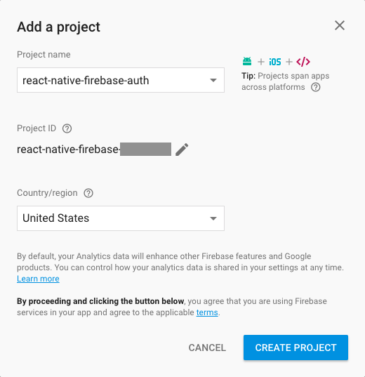
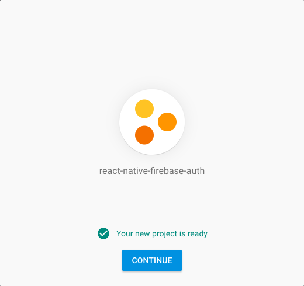
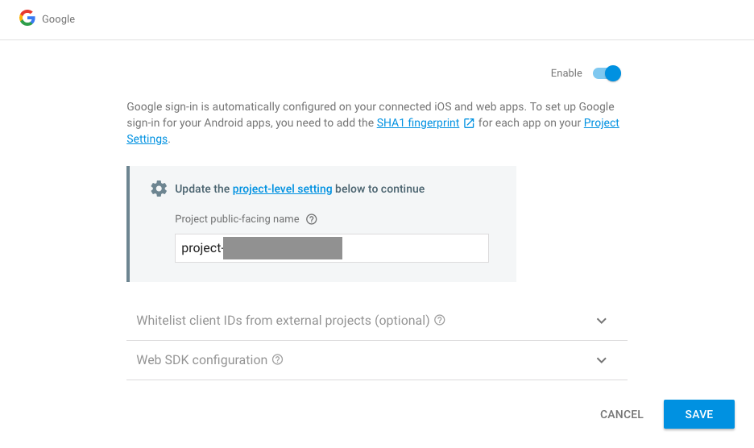

# React Native with firebase auth

This is a sample react native project with firebase auth integration.

# Setup

Go to `https://console.firebase.google.com` and create a new project

Follow the steps shown below:

